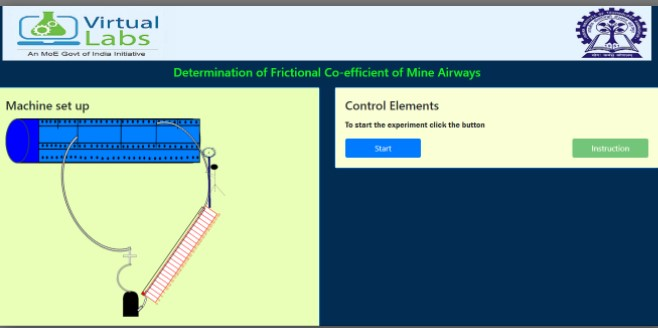

## Procedure

1. Dimension of the duct are noted with a measuring tape (length, breadth and height).
2. Inclined tube manometer is leveled and connected to the duct so that the pressure drop will be recorded.
3. As the air is following with a speed, the pressure drop is noted from inclined tube manometer.
4. At the same time, velocity of air flow is measured by continuous traverse of vane anemometer at one end of the duct.
5. A graph has to be plotted for the ΔP vs. (S V2 / A) values recorded for different air flow rates. The frictional coefficient will be calculated from the slope of the grape. In this way the frictional coefficient will be determined graphically from the above experimented result.

## Simulation Procedure

The following procedure is to be followed by the user in order to determine the friction coefficient of a duct:

Click on the button to start the experiment.

Enter the measuring points for the duct dimension in the fields and then click on the Yes button.

Click on the first flow control device from the left to measure the air velocity and the pressure drop. Click on "Anemometer Traversing".

Then stop the anemometer traversing by clicking the button "stop Anemometer".
Add the result to the observation table by clicking the button "Add result".

Repeat for all the flow control device is given.

After all the points are measured click on "Plot Graph" and then click on "Best Fit Graph". Print by clicking the button "Print".

